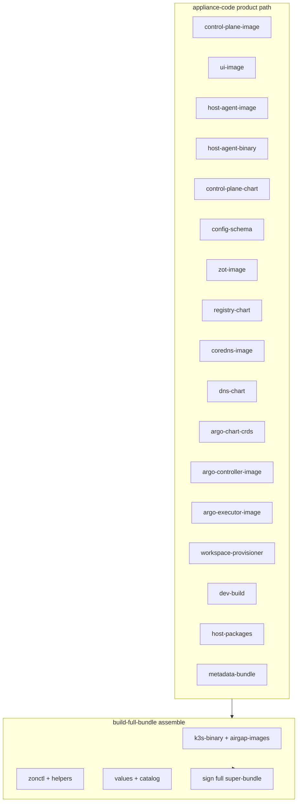

# Product component catalog (super-set packages)

This catalog is the stable contract for what lands in every complete product
`release-input` / signed air-gap super-bundle. It does **not** describe
install-time profile selection only. Host mDNS/Wi-Fi AP are day-2 Admin UI enablement.

Machine-readable list: [components.yaml](components.yaml).

## Package vs install

| Layer | Selects components? |
| --- | --- |
| `build-full-bundle` / release packaging | Always builds the full super-set below |
| `releasebundle.Assemble` | Copies whatever is in release-input (no profile filter) |
| `install.appliance_profile` | Modules activated on the target only |

## Component graph

## Stages (named build steps)

`scripts/ci/build-full-bundle.sh` still runs **all** product stages in order for
a complete build. Named stage IDs match `components.yaml` `id` fields so Phase C
fingerprints can attach to the same units.

| Order | Stage / recipe | Primary outputs |
| --- | --- | --- |
| 1 | `clone-repos` | RELEASE_WORK_ROOT checkouts |
| 2 | `host-packages` | `.run/host-packages/ubuntu/<VER>/amd64/*.deb` (mdns + wifi-ap) |
| 3 | `zot-image` / `dns-image` | first-class OCI archives + digest refs |
| 4 | `argo-crds` / `argo-controller` / `argo-executor` | Argo offline set |
| 5 | `workspace-provisioner` + `dev-build` | bundled offline image archives |
| 6 | `product-images` | control-plane, UI, host-agent OCI + host-agentd |
| 7 | `archive-release-input` | release-input tar (super-set) |
| 8 | `assemble-and-sign` | **always** re-run → signed `appliance-*-bundle.tar.gz` |

Incremental rebuilds (Phase C) may skip stages 2–6 when fingerprints match;
stages 7–8 always re-run so the published artifact is one consistent release.

## Developer slim path

`BUILD_COMPLETE_PRODUCT=false` (not used by the release skill) may omit Argo /
dev-build for local fixtures. Production packaging defaults
`BUILD_COMPLETE_PRODUCT=true` and fails closed if Argo or `registry.local/dev-build`
is missing.
