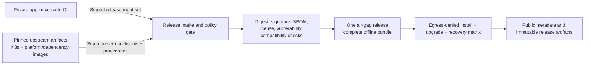

# Appliance Release And Packaging Plan

- Status: Accepted execution plan
- Product input producer: private `appliance-code` repository
- Release and installer producer: public `appliance-release` repository

## Purpose

This repository turns one signed, immutable product input set into one complete air-gapped Linux appliance bundle that an operator can install, upgrade, repair, back up, restore, diagnose, and safely remove without manually operating K3s, Helm, zot, or Argo Workflows and without public internet access.

It is a distribution and lifecycle repository. It does not contain or rebuild private application source.

## Strategy Update: Offline-First Zon Platform

This plan has pivoted to the Zon platform strategy. The CLI is `zonctl`.
**V1 uses one complete signed air-gap bundle** — `zonctl install`
verifies a local bundle containing K3s, the platform chart, CRDs,
configuration, and all required images. Installation and runtime must
work with public egress denied. Concretely:

- **Supported OS** is Ubuntu Server **22.04 LTS and 24.04 LTS** (not 24.04
  only).
- **K3s ownership** allows adopting an existing cluster: if it's safe
  (compatible or upgradeable version, no unrelated workloads), `zonctl`
  upgrades K3s automatically and proceeds; if unrelated workloads are
  present, it refuses unless given an explicit force/adopt flag — it
  never silently modifies a cluster it doesn't already own.
- **Versioning is two-tier**: a platform version pins the supported K3s
  version, chart versions, and image versions for a complete tested
  release; each service (`zon-core`, `zon-api`, `zon-ui`, `zon-registry`,
  `zon-observability`, ...) carries its own independent version.
- **The installer is manifest-driven**: the signed release manifest and
  bundle entries define the platform version, supported K3s version,
  chart/image versions, enabled components, default configuration, and
  migration information, rather than hardcoding these values.

Everything below describing schemas, verification, the lifecycle CLI
skeleton, the K3s/Helm/image adapters, and the command set (`preflight`,
`install`, `status`, `verify`, `backup`, `restore`, `upgrade`, `repair`,
`support-bundle`, `uninstall`, `factory-reset`) remains the
implementation foundation for the bundle-only appliance lifecycle.

## Accepted Decisions

- V1 supports a dedicated single-node Linux appliance with product-managed K3s.
- The supported host baseline is Ubuntu Server **22.04 LTS and 24.04 LTS** on `amd64` with local `ext4` storage. Additional platforms require their own complete qualification evidence. *(Revised: was 24.04-only.)*
- The primary installation path is an installer wrapper around a versioned Helm chart.
- **V1's only production installation path is the signed air-gap bundle.**
- The bundle resolves to pinned K3s, K3s platform images, all platform OCI images, the Helm chart, Argo CRDs, scanner data, and every required verification artifact.
- Installation and runtime must operate without public network dependency.
- Installing only the workload chart onto an arbitrary existing Kubernetes/K3s cluster (bypassing `zonctl`'s K3s ownership and adoption flow entirely) is not a supported v1 production mode. The chart remains independently renderable for development, CI, and future qualification.
- `appliance-release` consumes immutable signed outputs from `appliance-code`; it never clones private source, rebuilds the control plane, forks the canonical chart, or changes product security policy.
- OCI tooling terminology and implementation use Buildah, Podman, Skopeo, ORAS, zot, and Helm explicitly.

## Repository Boundary

| Owned here | Supplied by `appliance-code` |
| --- | --- |
| Host detection, preflight, and safe remediation | Control-plane OCI image |
| K3s installation, configuration, pinning, and lifecycle | Canonical appliance Helm chart and values schema |
| Complete air-gap artifact acquisition and closure | Argo CRD bundle and compatibility tuple |
| Final release manifest and bundle assembly | Workflow templates embedded in/versioned with product inputs |
| Installer, upgrader, repair, backup, restore, diagnostics, and uninstall UX | Configuration schema and bootstrap contract |
| Public support matrix, notices, release notes, and verification guide | Migration compatibility and application lifecycle hooks |
| Host-level and end-to-end release tests | Black-box API/MCP/OCI conformance suite |
| Distribution signing and publication | Product SBOMs, provenance, notices, signatures, and compatibility evidence |

The release pipeline may reject a product input but cannot patch it. Product fixes must produce a new immutable input candidate.

## Release Pipeline



The trusted release pipeline may access private candidate storage. The public repository and installer require no private-repository credentials.

## Required Product Input

The release pipeline accepts a directory or OCI artifact with this logical structure:

```text
release-input/
  release-input.json
  control-plane.oci.tar.zst
  appliance-chart-<version>.tgz
  argo-crds-<version>.tar.zst
  configuration.schema.json
  compatibility.json
  checksums.txt
  sbom/
  provenance/
  notices/
  tests/
```

Intake fails closed when:

- the manifest schema is unsupported
- a digest, signature, provenance identity, or size does not match
- an artifact uses a mutable tag without an immutable digest
- the K3s/Kubernetes, chart, Argo CRD/controller/executor, zot, or OCI toolchain tuple is incompatible
- required license notices or SBOMs are missing
- vulnerability policy fails without a signed, scoped, expiring exception
- migration metadata does not support the declared upgrade source

## Third-Party Inputs

The release manifest pins and verifies:

- K3s binary, install script, checksums/signatures, and official air-gap image archive
- K3s-bundled Traefik and platform component identities
- zot
- Argo Workflow Controller and executor images plus CRDs
- Buildah task image
- Skopeo and ORAS utility images
- Syft and Grype images plus the separately identified offline Grype database bundle
- any release-only verification utilities

Acquisition uses allowlisted upstream locations and immutable identities. Release assembly mirrors with Skopeo/ORAS and does not require a resident OCI runtime service. Every third-party license, notice, SBOM, provenance record, and policy result is retained in the final evidence set.

Deployment bootstrap must not depend on the appliance's own zot instance. Installation preloads every deployment image from the bundle into the K3s image store before any appliance pod starts. zot becomes the product data-plane registry only after rollout.

## Release Artifacts

### Complete Air-Gap Release

```text
appliance-<version>-airgap-ubuntu-24.04-amd64.tar.zst
  appliance
  release-manifest.json
  release-manifest.sig
  k3s/
    binary/
    install/
    images/
  oci-images/
  charts/
  crds/
  configuration/
  scanner-data/
  sbom/
  provenance/
  notices/
  public-keys/
  tests/
```

Installation performs no network access. The test suite verifies this with network egress blocked.

The `appliance` command is the versioned lifecycle entrypoint. It reads only bundle-local artifacts listed in the signed release manifest, verifies them before privileged changes, and records the exact installed state. A missing artifact is a hard integrity failure; there is no remote fallback.

Large archives and generated OCI payloads are published as immutable release assets or in an artifact store referenced by the signed manifest. They are not committed to Git history. The public repository contains their schemas, assembly/verification code, metadata, and documentation.

## Installer Lifecycle

The public command contract should converge on:

```text
appliance preflight
appliance install
appliance status
appliance verify
appliance backup
appliance restore
appliance upgrade
appliance repair
appliance support-bundle
appliance uninstall
appliance factory-reset
```

Destructive commands require an explicit confirmation mechanism suitable for both interactive and controlled non-interactive operation. `uninstall` preserves appliance data by default. `factory-reset` requires a recent verified backup or a separately confirmed data-loss override.

### Fresh Install Sequence

1. Acquire a host-wide installer lock and detect an interrupted prior operation.
2. Verify the release manifest and every bundle-local artifact.
3. Run read-only preflight for OS/architecture, CPU/RAM, disk/inodes, `ext4`, cgroup v2, kernel/user namespaces, time, internal DNS, hostname/TLS SANs, ports, firewall, and conflicting services.
4. Present the exact planned changes. Apply only documented safe remediations; never weaken security controls silently.
5. Create protected appliance directories and an atomic installed-state journal.
6. Install the pinned K3s binary as a system service using the release-owned configuration file and disable unattended K3s advancement.
7. Import every bundled image by digest into the K3s image store and verify that no image pull can fall through to a public registry.
8. Wait for and verify K3s, CoreDNS, storage provisioner, Traefik, networking, and metrics dependencies.
9. Apply the bundled versioned Argo CRDs before the chart.
10. Generate purpose-separated secrets and TLS material, or validate operator-supplied certificates, without command-line leakage.
11. Install the exact Helm chart with schema-validated values and wait for rollout.
12. Run bootstrap through the supported application mechanism and disable replay.
13. Run product-supplied black-box REST, MCP, OCI, auth, and dependency-health smoke tests.
14. Persist the verified installed-state record and print access, backup, and recovery instructions.

Failure before completion performs a bounded rollback only for changes proven safe to reverse. Once durable state has been created or migrated, recovery follows the recorded transaction journal and backup policy rather than deleting data.

### Upgrade Sequence

1. Verify source version, target manifest, host capacity, compatibility, certificates, and free space.
2. Produce and verify the mandatory pre-upgrade recovery set.
3. Quiesce new builds/workflows and reconcile or stop in-flight operations according to policy.
4. Stage K3s and OCI artifacts without replacing the active version.
5. Upgrade K3s only when required by the accepted compatibility tuple.
6. Upgrade Argo CRDs before its controller/chart and refuse unsupported CRD downgrade.
7. Apply the chart and run application migrations through supported hooks.
8. Run health and conformance checks, then resume workflow submission.
9. On failure, use the declared N-1 rollback or restore the complete pre-upgrade recovery set.

## Host Preflight Policy

The goal is zero manual platform work for a supported, healthy host, not pretending every Linux system is compatible.

Preflight classifies findings as:

- `pass`: requirement is already satisfied
- `auto-fix`: deterministic, reversible, documented change that the installer may perform with approval
- `operator-action`: environment-specific change such as internal DNS, firewall, storage, or certificate provisioning
- `unsupported`: installation stops because the host is outside the qualified matrix

Checks are machine-readable, individually testable, idempotent, and included in support bundles with secrets redacted.

## K3s Ownership

- Zon pins K3s and owns its configuration, service lifecycle, snapshots, and supported upgrade path.
- K3s configuration is written as files rather than relying on transient installer environment variables.
- K3s auto-upgrade is disabled unless a later signed Zon release explicitly orchestrates it.
- The installer never invokes a destructive upstream K3s uninstall path as the normal Zon uninstall because platform PVC and datastore preservation must be deliberate.
- **Existing K3s adoption policy** *(revised from air-gap-only v1, which rejected any unrelated cluster outright)*: on detecting an existing K3s cluster, `zonctl` checks its version, health, whether it's already Zon-managed, and whether it carries non-Zon workloads.
  - If it's already owned by this exact Zon version, reuse it as-is.
  - If it's owned by an older compatible Zon version, the upgrade path applies.
  - If it's unowned but otherwise healthy and carries no unrelated workloads, it may be automatically adopted: K3s is upgraded to the supported version if required, and installation proceeds.
  - If it carries unrelated (non-Zon) workloads, `zonctl` never silently modifies it — adoption requires an explicit `--force`/adopt flag acknowledging the cluster is being taken over.

## Security And Supply Chain

- Bootstrap trust starts from a small pinned public verification key distributed independently or embedded in the versioned installer.
- Verify before execution or import: installer updates, K3s, OCI image archives, charts, CRDs, scanner data, configuration schemas, and conformance tests.
- Privileged host operations are minimal, logged, and separated from unprivileged verification and bundle inspection.
- Secrets are generated on the target or accepted through protected files/descriptors. They never appear in Git, release bundles, command arguments, logs, or support bundles.
- Installation is tested with public egress denied and has no remote fallback endpoints.
- No released component enables background internet updates, telemetry, public database refresh, dynamic plugin retrieval, or external license checks.
- Final manifests, checksums, SBOMs, provenance, vulnerability/license results, and notices remain available for offline verification.

## Proposed Repository Structure

```text
cmd/
  appliance/
internal/
  manifest/
  verify/
  preflight/
  host/
  k3s/
  images/
  helm/
  lifecycle/
  state/
  support/
bundle/
  airgap/
schemas/
scripts/
  assemble/
  test/
docs/
  release-plan.md
  install.md
  upgrade.md
  backup-restore.md
  security.md
  troubleshooting.md
tests/
  fixtures/
  host/
  integration/
  airgap/
```

Prefer a small compiled Go lifecycle CLI over an expanding shell installer. Shell may remain only as a minimal shim that verifies and invokes the CLI binary already present in the bundle.

## Make Targets

The current packaging-only repo keeps a much smaller target surface than
the original plan. `zonctl` now lives in `appliance-ctl`, so this repo
focuses on bundle assembly and local packaging checks.

```text
make verify
make assemble-bundle
make init-simple-workspace
make fetch-release-input
make prepare-simple-workspace
make assemble-simple-bundle
make verify-bundle
make product-bundle
make sample-product-bundle
make clean
```

`make verify` is the pre-commit gate for this repo. It runs local shell
syntax checks, script `--help` smoke checks, JSON example validation,
and then `make clean`.

## Execution Ledger

| ID | Executable outcome | Depends on | Completion evidence |
| --- | --- | --- | --- |
| R0-01 | Define `release-input.json`, final release-manifest, installed-state, evidence, and command schemas | Product boundary contract | Versioned schemas plus valid/invalid fixtures |
| R0-02 | Pin supported host baseline and implement read-only preflight | R0-01 | Unit tests and clean/invalid-host VM evidence |
| R0-03 | Implement signature, digest, provenance, SBOM, license, and vulnerability policy verification | R0-01 | Tamper, missing-evidence, wrong-identity, expiry, and offline tests |
| R1-01 | Build the lifecycle CLI skeleton, locking, transaction journal, redacted logging, and dry-run | R0-01 | Unit/race/failure-injection tests |
| R1-02 | Implement K3s install/configuration/status ownership adapter | R0-02, R1-01 | Fresh host, restart, interrupted install, and conflict tests |
| R1-03 | Implement offline OCI image preload and Helm/CRD application adapters | R0-03, R1-01 | Digest, ordering, idempotency, rollback, missing-artifact, and egress-denied tests |
| R2-01 | Assemble, verify, and install the complete air-gap bundle end to end | R1-02, R1-03, accepted product input | Egress-denied fresh-install and no-remote-fallback evidence |
| R3-01 | Implement status, verify, repair, diagnostics, and redacted support bundle | R2-01 | Dependency-failure and secret-leakage suite |
| R3-02 | Implement coordinated backup and clean-node restore | R2-01 | Automated offline RPO/RTO drill with integrity evidence |
| R4-01 | Implement N-1 upgrade, failed-upgrade recovery, and restore-based rollback | R3-02 | Every supported source-to-target matrix passes |
| R4-02 | Implement uninstall-preserving-data and separately guarded factory reset | R3-02 | Data-preservation and destructive-confirmation tests |
| R5-01 | Publish public docs, support matrix, release notes, notices, and offline verification guide | R2-01, R3-01 | Documentation and artifact consistency checks |
| R5-02 | Run final egress-denied air-gap release qualification and publish immutable artifacts | R4-01, R4-02, R5-01 | Signed release evidence with all gates passing |

## Release Acceptance

A release is complete only when:

1. Public source contains no private product source, credentials, signing keys, customer data, or internal CI coordinates.
2. Every byte installed is selected by an immutable signed manifest and verifies offline.
3. Fresh installs from the complete bundle pass with public egress denied on every supported host baseline.
4. Re-running install is idempotent; interrupted operations resume or fail with safe, actionable recovery.
5. K3s, Traefik, control plane, zot, Argo, workflow tasks, storage, and ingress pass health and security checks.
6. Product-supplied REST, MCP, OCI, authentication, authorization, and build conformance tests pass against the installed appliance.
7. Backup and clean-node restore meet the published RPO/RTO.
8. N-1 upgrade, failed-upgrade recovery, and restore-based rollback pass.
9. Uninstall preserves data by default; factory reset cannot occur accidentally.
10. Support bundles and logs pass automated secret and personal-data leakage checks.
11. SBOM, provenance, vulnerability/license reports, notices, checksums, signatures, and support metadata agree with the installed state.

## Deferred

- Installation onto an arbitrary pre-existing **non-K3s** Kubernetes distribution (existing K3s may now be adopted per the K3s Ownership policy above; other Kubernetes distributions are still out of scope)
- Multi-node or HA K3s
- Additional Linux distributions or architectures without full qualification (Ubuntu Desktop as an explicit advanced/unsupported mode is a candidate for a later phase, not v1)
- Bootable ISO, VM image, or hardware image distribution
- Automatic release-channel upgrades
- Public Argo Server/UI
- Argo workflow archive database
- External identity-provider installation
- Package/profile variants of the complete v1 topology
- Connected or alternate installer profiles
